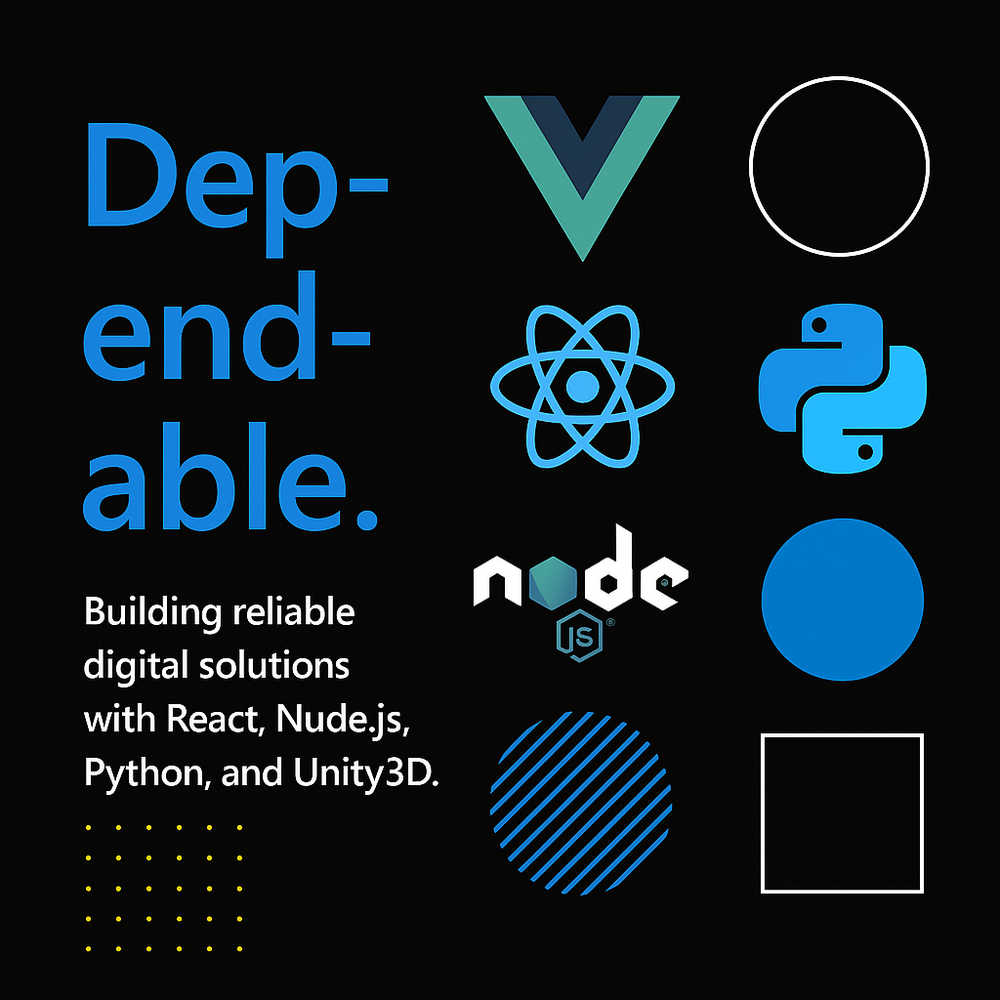

# 👨‍💻 Leo Evans – Full-Stack & Game Developer

###

Welcome! I'm Leo Evans, a freelance developer with experience in building modern web applications and immersive games.

---

## 🛠️ Tech Stack

- **Frontend:** React, Vue, Tailwind CSS, JavaScript/TypeScript
- **Backend:** Node.js, PHP (Laravel), Python (Flask/Django)
- **Game Development:** Unity3D (C#)
- **Others:** Git, Firebase, REST APIs, WebSockets

---

## 🚀 Featured Projects

| Project              | Description                        | Tech Used                    |
|----------------------|------------------------------------|------------------------------|
| React Dashboard      | Admin panel with Tailwind UI       | React, Node.js, MongoDB      |
| Unity Puzzle Game    | 2D mobile puzzle with animations   | Unity, C#                    |
| Vue CMS              | Personal blog & CMS                | Vue, Firebase, Markdown      |

---

## 📈 Also Experienced With

- 📈 Crypto, Stocks, Forex & Binary Options Trading
- Building custom trading dashboards and financial visualizations

---

## 📬 Contact

- ✉️ Email: coderion0627@gmail.com  
- 🌐 Portfolio: [leo-dev.vercel.app](https://leo-dev.vercel.app)  
- 🔗 GitHub: [github.com/leo-evans](https://github.com/leo-evans)

---

> ⚡ *Building clean, scalable, and human-centered software solutions.*
